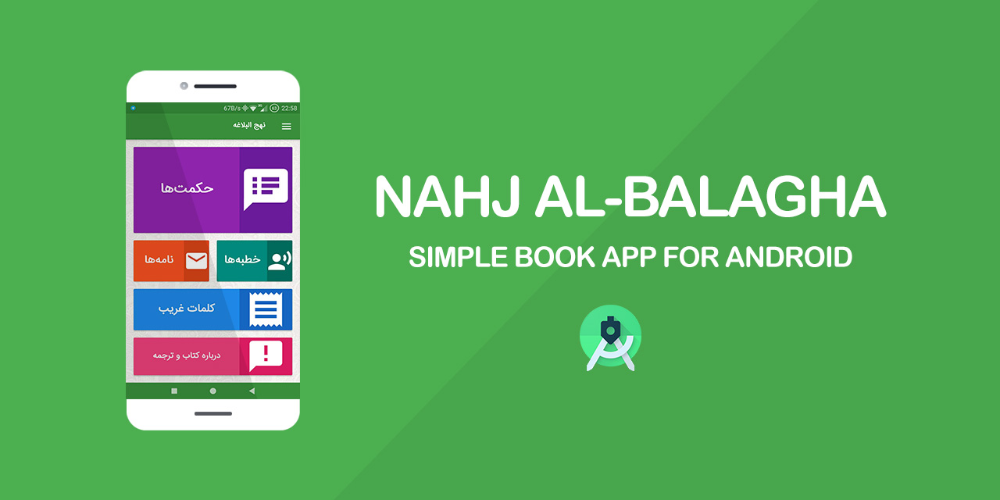
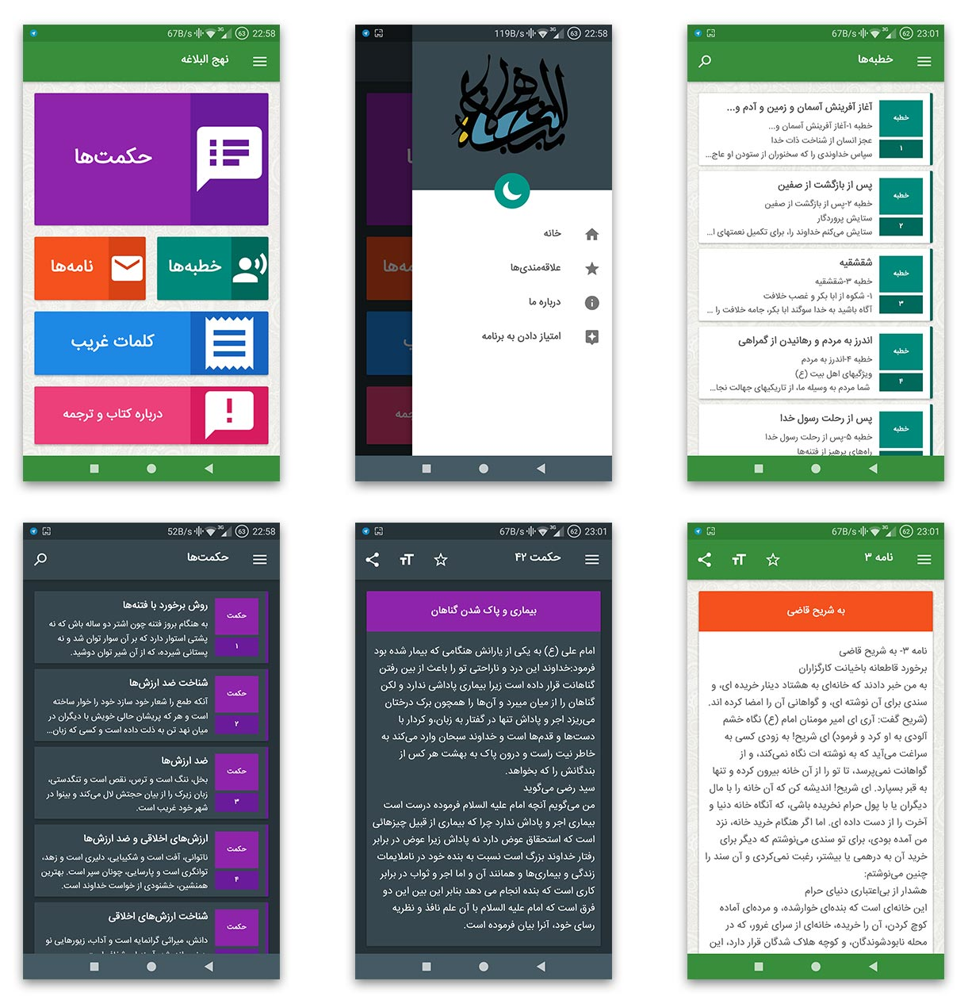

# Nahj al-Balagha

It's a simple book app created with Android Studio. Source of the project is available, just open the `src` folder as a project in Android Studio and start modifying.

## Release
- View on [APKPure](https://apkpure.com/p/ir.geraked.nahj).
- View on [Myket](https://myket.ir/app/ir.geraked.nahj).

## Author
**Rabist** - view on [LinkedIn](https://www.linkedin.com/in/rabist)

## License
Licensed under [MIT](LICENSE).
